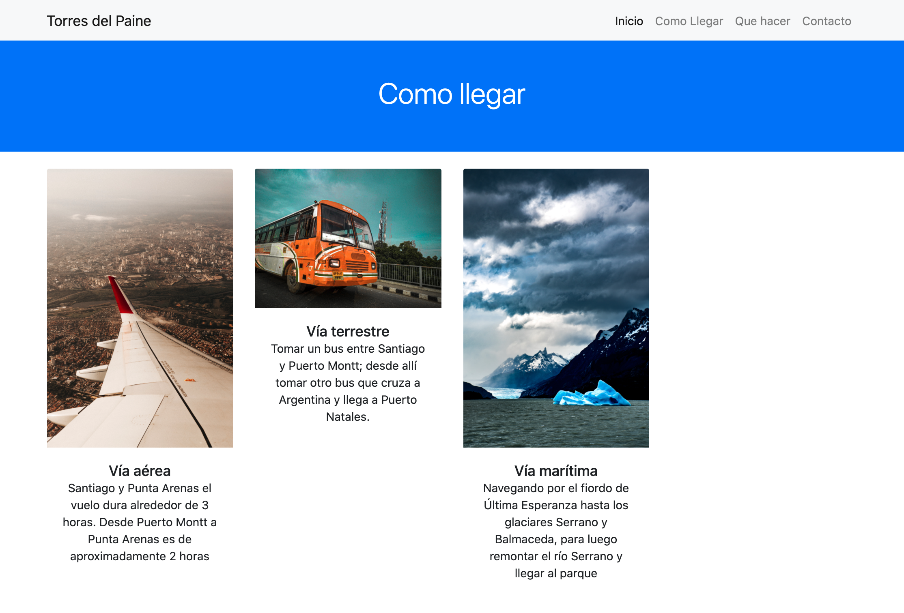
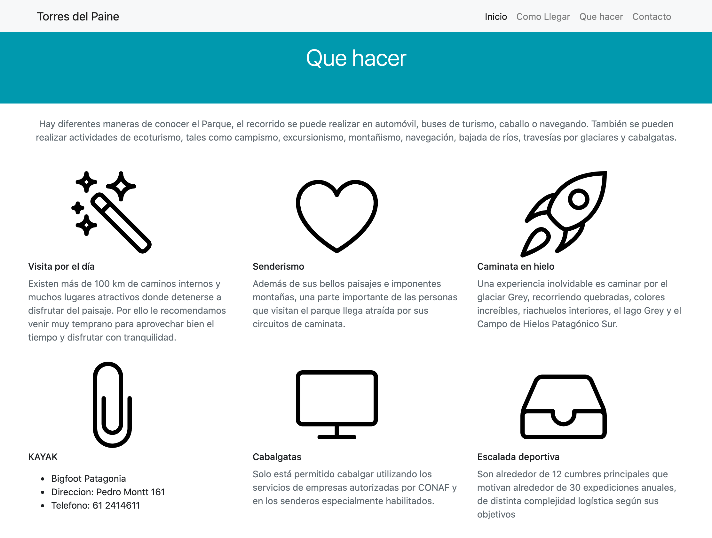
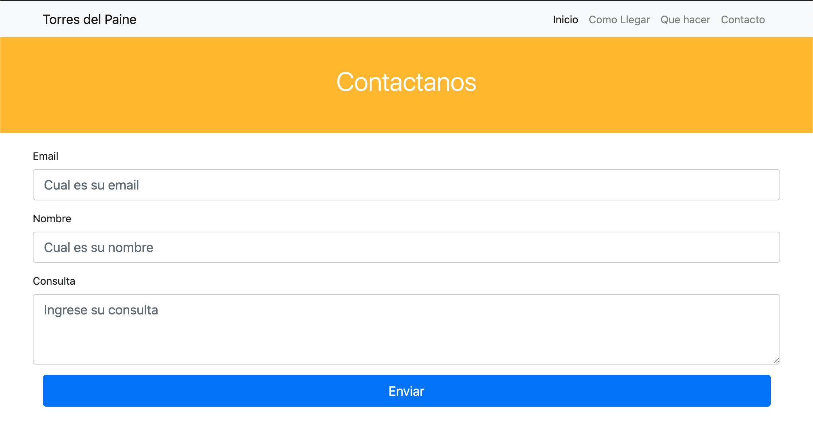

## Proyecto de maquetación utilizando Bootstrap
Utilizando boostrap 4 realizaremos el siguiente layout:

## Layout: Inicio

## Layout: Como Llegar

## Layout: Que hacer

## Layout: Contacto

## Recursos

- [Carrousel](https://getbootstrap.com/docs/4.0/components/carousel/) 
- [Jquery para que funcione el carousel](https://code.jquery.com/jquery-3.3.1.slim.min.js) 
- [linearicons.com](https://linearicons.com/free) 

## Requisitos
- Trabajando colaborativamente cumplir con el layout indicado

- Todas las tareas se encuentran en [Maqueta-torres-del-paine](https://github.com/mortegac/frenon-layout-bootstrap/projects/1?add_cards_query=is%3Aopen) 

- Utilizar hoja de estilos externas al documento.

- El proyecto deberá realizarse en el repositorio  `github.com/mortegac/frenon-layout-bootstrap`.

- Por cada tarea deben crear una rama/branche con el formato `feat/descripcion-tarea` o `fix/descripcion-tarea` según corresponda.

- Se debe pedir Pull Request a la rama/branche `develop`

- Al terminar el proyecto debe realizar la entrega en https://classroom.google.com/